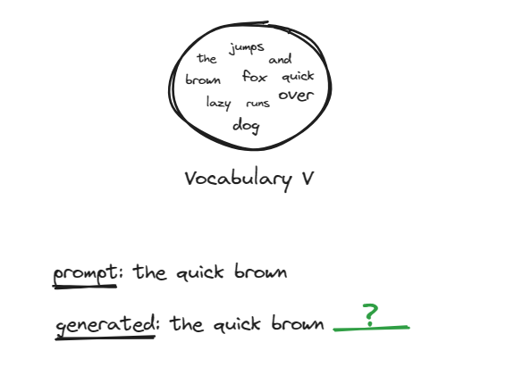
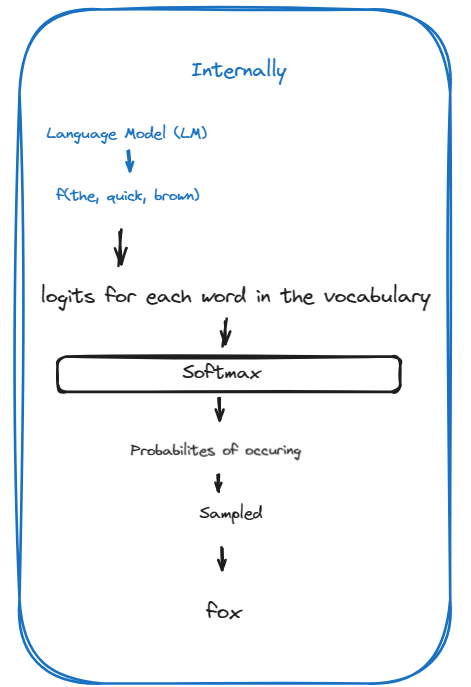

import Image from 'next/image'

# Understanding Language Models

Language models have a vocabulary \( V \) which contains words or smaller units of words known as tokens.

## How Language Models Function

A language model can be thought of as a function, let's call it \( f \), that takes a sequence of known words (which we call tokens) from your prompt. When you give it the beginning of a sentence like "The quick brown," it analyzes this and predicts what words usually come next. Each word in the vocabulary is given a score to indicate how likely it is to follow the previous words. This score is known as a logit. We get a vector of logits for every word in the vocabulary!

## Logits to Probabilities

Next, the logits or the raw scores are converted into probabilities using a mathematical function called softmax. Here's a breakdown of the logits and their converted probabilities for various potential next words:

| Word    | Logit | Probability |
|---------|-------|-------------|
| fox     | 2.241 | ↓ 0.293     |
| jumps   | 1.868 | ↓ 0.202     |
| the     | 1.764 | ↓ 0.182     |
| brown   | 0.979 | ↓ 0.083     |
| lazy    | 0.950 | ↓ 0.081     |
| and     | 0.411 | ↓ 0.047     |
| quick   | 0.400 | ↓ 0.046     |
| runs    | -0.103| ↓ 0.028     |
| dog     | -0.151| ↓ 0.027     |
| over    | -0.977| ↓ 0.012     |

## Sampling the Next Word
After converting logits to probabilities, the model samples a word to be the next after "brown," and this sampling can be done in multiple ways. For now, it samples 'fox'. Therefore, the sentence now becomes 'The quick brown fox'.

The next step will be $f(\text{the}, \text{quick}, \text{brown}, \text{fox})$ and so on.

