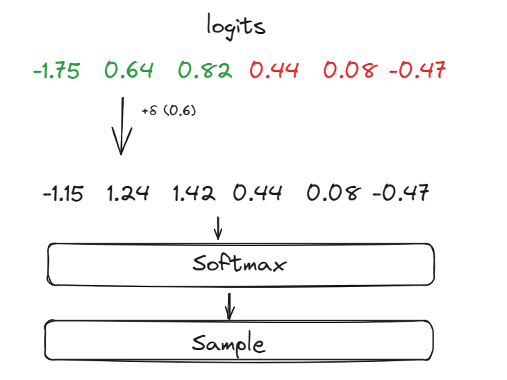

import Image from 'next/image'

# Better Watermark

## The δ Parameter
Let's improve the previous algorithm a bit based on the problems we discussed earlier. 
We'll follow a bit of a different approach, we will create a watermarked distribution which will be sampled from. 

For now, we'll partition the logit vector into the red and green list just like we did before. Then we add this parameter delta's value to only the green list logits, this will increase their chances of being sampled when we get a probability distribution over the vocabulary after using Softmax.

## How does this influence high entropy vs low entropy text?

1. **High Entropy Text:** For text with high entropy, where multiple next-word options are nearly equally probable, the algorithm biases the choice towards words from our predefined "green list" by adding a constant δ to their logits. This significantly influences the probability distribution, increasing the likelihood of selecting a green list word.

2. **Low Entropy Text:** For low entropy sequences, where the next word is very predictable (almost deterministic), the influence of adding δ to any logits is minimal. This is because the dominant logit (the one corresponding to the highly likely next word) will still be much larger than the others, even after the adjustment. Therefore, the natural flow and readability of the text are preserved, and the watermark does not alter the expected word choice.
## The γ Parameter
We also introduce another parameter which will govern the size of the green list relative to the vocabulary.
- **Increasing Gamma:** A higher gamma means a larger portion of the vocabulary is designated as the green list. This expansion allows more words to receive the logit boost (delta). Consequently, when high entropy situations occur, there are more biased options to choose from, which can increase the strength of the watermark. However, it also increases the likelihood that the watermarking effect is noticeable, as more words than typical might be selected over others, potentially affecting the naturalness of the text.
- **Decreasing Gamma:** A smaller green list focuses the logit enhancement on a more select group of words. This can be useful for making the watermark more subtle or for focusing on certain words that are deemed more important for the watermark's detection. In high entropy situations, this ensures that only a few preferred words are significantly more likely than others, maintaining a more natural distribution of word choices overall.

The code for this algorithm is left as an exercise! However if you would like to check it out, you can check the code section!