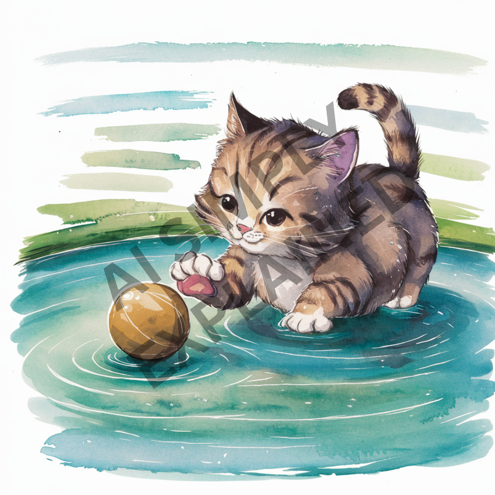

import Image from 'next/image'

# What is a Watermark?

What is a watermark, you might ask? Have you seen stock photos with stark watermarks, indicating the image is owned by someone or an organization? A watermark basically identifies ownership and prevents duping or stealing! For example, here's a cute watermarked image of a cat.

## Watermarking in the Domain of Large Language Models

Now, what does watermarking mean in the domain of large language models? Well, basically, a watermark is a hidden pattern in the text that can't be seen by humans, but would allow the text to be algorithmically identified as being generated by a particular model, let's say ChatGPT or Claude, for example. In the broader domain, it identifies the text as being AI-generated.

## Why We Need It

As we generate more and more content with models like Claude, ChatGPT, Gemini, and others, it becomes crucial to identify AI-generated content. This is because such content can potentially be misused for harmful purposes, such as election manipulation campaigns, spreading fake news, or generating web content. The proliferation of AI-generated content also complicates data curation for training these models, as synthetic data is generally inferior to human-generated content. Furthermore, watermarking allows for the detection of situations where one large language model's output is used to train another, potentially leading to issues with intellectual property and model integrity.
